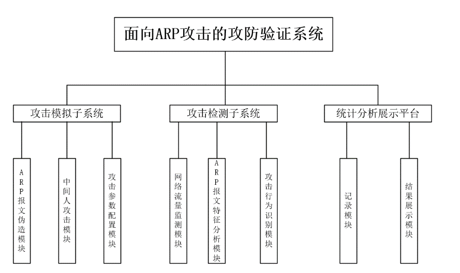
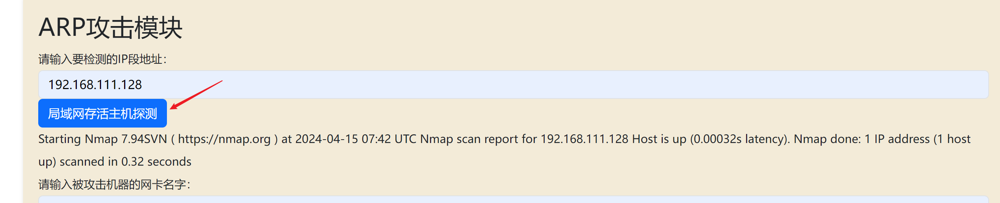
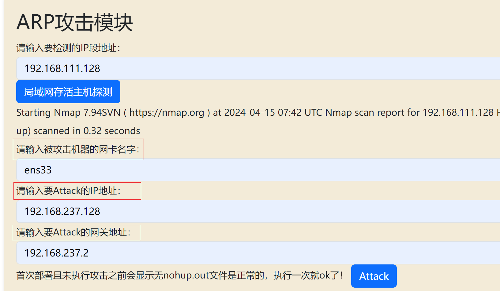
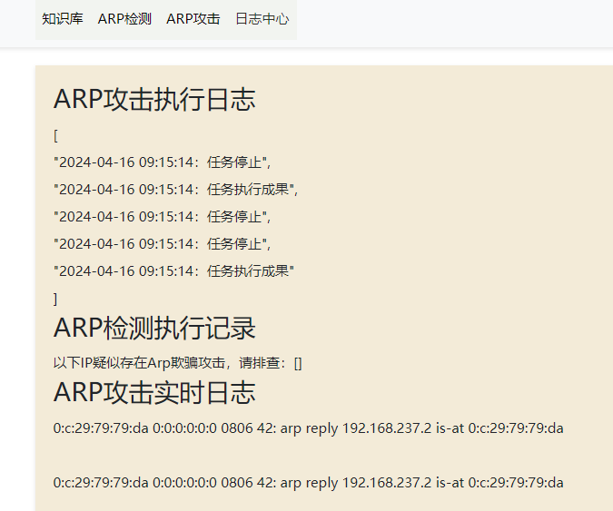
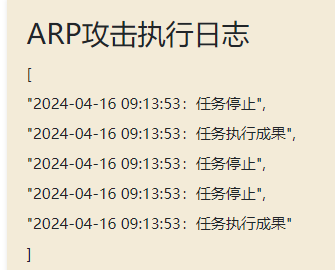

# arpcheat
> 开题报告+毕业论文+毕业设计+答辩PPT+查重....
#### 介绍
ARP攻防系统   
1. **技术选型**：选择Python作为开发语言，利用其丰富的网络编程库和强大的数据处理能力，实现ARP攻击和检测模型的构建以及网站平台的开发。
2. **模型开发**：利用Python的网络编程能力，编写ARP攻击模拟代码和攻击检测，构建高效的攻击和检测模型。
3. **网站设计**：采用前端框架和后端框架，设计并实现用户友好的网站界面，提供便捷的操作和展示功能。

#### 软件架构展示

#### 安装教程

1.  直接git clone代码仓库
2.  安装python及所需的requirements.txt（pip install -r requirements.txt）
3.  运行app.py程序
4.  下载nmap及arpspoof软件

#### 使用说明

1.  ARP攻击介绍   
- ARP漏洞的危害！ 
ARP漏洞的危害极大，它可能导致局域网内的计算机无法正常通信，造成网络延迟甚至中断。攻击者可以利用此漏洞窃取敏感信息，掌控目标设备，进而发起更多攻击，如DDoS攻击或挖矿恶意软件，导致系统崩溃或财产损失。此外，受攻击设备还可能成为传播恶意软件或钓鱼活动的平台，给其他用户带来安全隐患。
- ARP漏洞的检测!
ARP漏洞的检测主要依赖于命令行工具和网络监控软件。通过输入“arp -a”命令查看ARP缓存表，检查网关MAC地址是否异常或IP地址与MAC地址映射错误。同时，使用ARP防火墙实时监测网络数据包，及时发现并拦截异常ARP请求。此外，定期检查网络设备和交换机状态，确保网络运行正常。
- ARP漏洞的防护!
ARP漏洞的防护可从多方面着手：首先，实施静态ARP绑定，确保IP与MAC地址固定对应；其次，启用ARP防火墙，监控并拦截异常ARP请求；最后，利用交换机DAI技术，在源头阻断ARP攻击。综合采取这些措施，可有效降低ARP漏洞带来的安全风险。

1.  ARP攻击
局域网主机探测

ARP攻击参数填写   

1.  ARP检测
ARP攻击检测日志   

4.  ARP日志
日志模块   

攻击执行日志   

攻击实时日志   

#### 参与贡献

1.  Fork 本仓库
2.  新建 Feat_xxx 分支
3.  提交代码
4.  新建 Pull Request

#### 特技
> 没有什么技能是不能掌握的，只要你肯努力，肯付出，总会有所收获。有问题请联系。   
> 安全公众号：安全info   
> 个人WX：tomorrow_me-   
> QQ讨论群：830709780   

